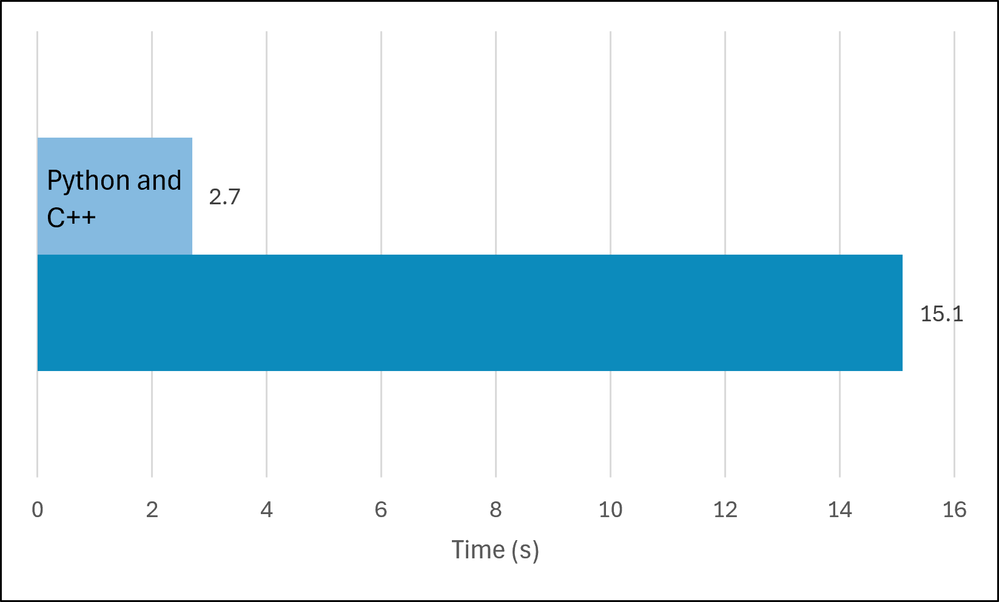

### Mandelbrot Set calculation and visualisation in python, optimised

This is a small project to show how much speedup can be achieved using pybind11 and C++ extentions. Here are the files and what they are for:

- main.py: contains two functions for calculating the mandelbrot set both slow (pure python) and fast (using c++ wiht pybind11), and uses pillow to draw.
- main.cpp: contains the core mandelbrot calculation function that compiles into main.pyd.
- main.pyd: this is a python module compiled from the c++ file. This holds the fast code that python calls in the fast function.
- make.bat: the compilation call for the c++file to make the python module. Used for Windows.

Implementing C++ extentions for the slower functions in python results in massive speedup. On my machine, here are the times for pure python and python + c++ using pybind11:
